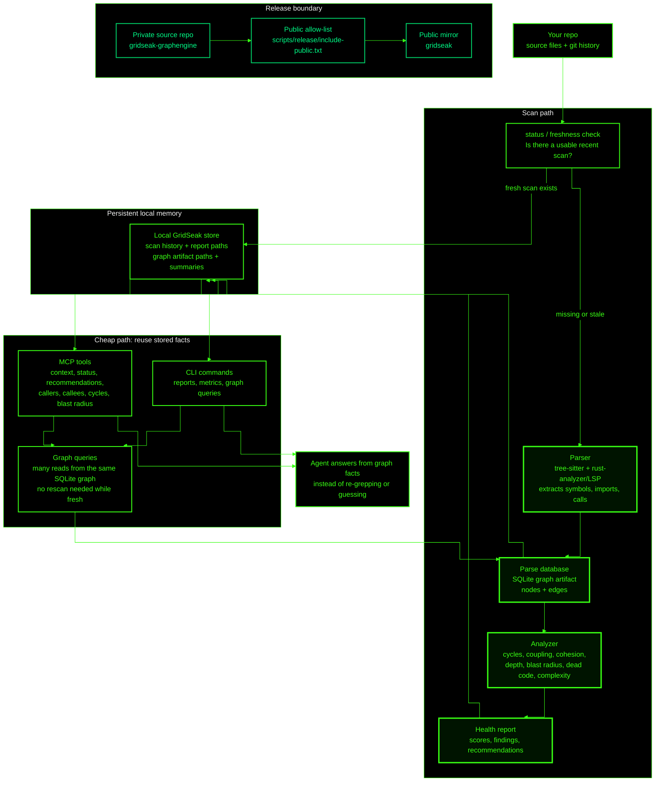

# GridSeak Core System Mental Model

## One-Sentence Model

GridSeak performs an expensive scan only when facts are missing or stale, stores the resulting graph/report locally, and then serves many cheap MCP/CLI queries from that stored graph.

## Component Roles

| Component | Mental model |
| --- | --- |
| Status / freshness check | Decides whether the existing scan can be trusted or a new scan is needed. |
| Parser | Converts code into structural facts. |
| Parse database | The durable graph map of what depends on what. |
| Analyzer | Scores the map and finds risks. |
| Local store | Keeps scans, reports, and history on your machine. |
| MCP / CLI | Query surfaces over the same local facts without rescanning each time. |
| Public mirror | A curated subset copied from the private source repo. |

## Key Separation

| Path | Cost | When it runs |
| --- | --- | --- |
| Scan path | Expensive | First time, after meaningful source changes, or when cache is stale. |
| Query path | Cheap | Repeatedly, whenever an agent or human asks questions about the latest graph. |
