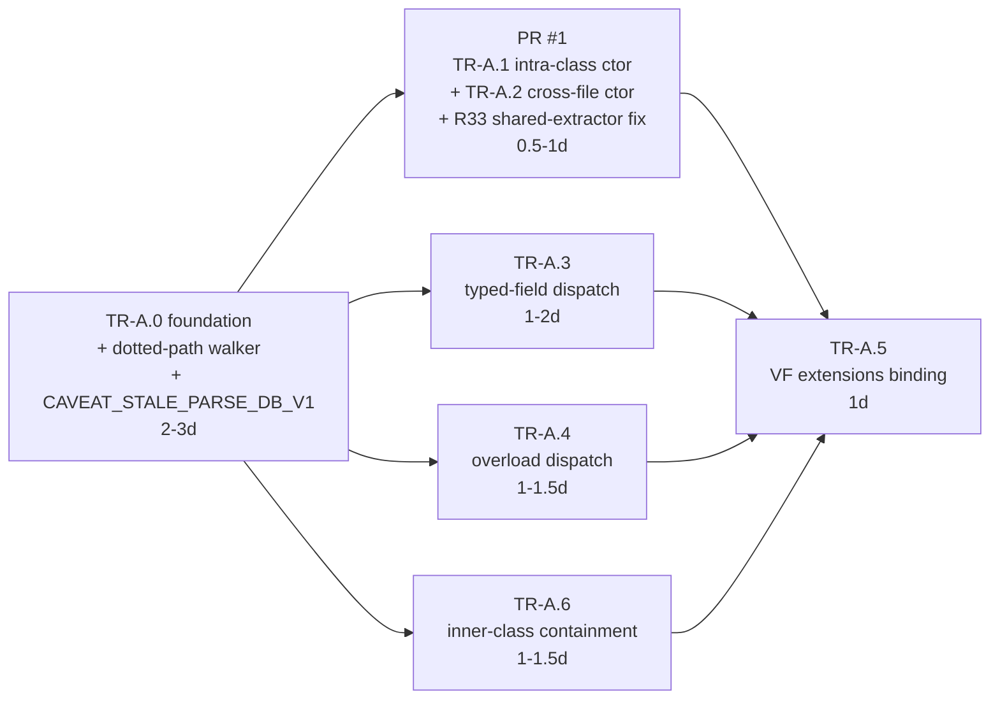

# Phase A execution plan — Apex type-oracle foundation + AST resolver gaps (R23)

> **Reproducing historical numbers / paths cited below.** Neither the historical baseline JSONs / calibration outputs nor the rev6.1 byte-identical regression fixture referenced in this document are tracked in git — both live as sha256-pinned GitHub release assets. Fetch on demand with `scripts/setup.sh historical-baselines` (rev3..rev11 evidence, [release](https://github.com/adenjessee/gridseak-graphengine/releases/tag/baseline-archive-2026-05-18)) and `scripts/setup.sh fixtures` (rev6.1 regression fixture, [release](https://github.com/adenjessee/gridseak-graphengine/releases/tag/regression-fixtures-2026-05-19)). All artifacts are pinned in `experiments/artifacts.lock`. The active build/test loop does not require any of them.

**Type:** Execution plan
**Owner:** WS-TRUTH-A (`docs/02-strategy/SPRINT_PLAN.md`)
**Authoritative scope:** `docs/workstreams/proof-foundation-gap/TRUTHFUL_SCANS_ROADMAP.md` §4
**Authoritative technical spec:** `docs/workstreams/apex/FRAMEWORK_RESOLVER_PLAN.md` §4.11, §4.11.1, §4.11.2
**Risk coverage:** R23 (closes), R32 (closes), R33 (new — closes), R34 (new — scoped handoff to WS-PROOF-R3)
**Effort:** 7–10 days
**Status:** Planned — ready to execute on approval

This document is the single concrete contract for how Phase A is built,
verified, and shipped. It supersedes any in-chat plan drafts. Every PR
in WS-TRUTH-A links back to the ticket subsection here.

---

## 1. Ticket inventory and dependency graph

Seven tickets, three waves. TR-A.0 is a hard prerequisite for every
other ticket; A.1+A.2 ship in one PR; A.3/A.4/A.6 run in parallel;
A.5 is the tail task.



**Design decision (P1 in planning review).** The dotted-path
containment walker is TR-A.0 infrastructure, not TR-A.6 behaviour.
TR-A.6 consumes the walker + the inner-class table; it does not own
the walker. This decouples A.3 / A.4 / A.6 so they run genuinely in
parallel.

**Design decision (ticket-pairing).** TR-A.1 and TR-A.2 share an
extractor change and a resolver arm shape; pairing them in one PR
avoids a two-step review of the same constructor-resolution code path.

---

## 2. TR-A.0 — Apex type-oracle foundation (2–3 d)

### 2.1 Non-negotiable safety gate

Re-running `ge-analyze` on `experiments/results/NPSP/rev6.1/parse.db`
(a pre-TR-A.0 parse DB) after TR-A.0 lands must produce a HealthReport
byte-identical to `experiments/results/NPSP/rev6.1/baseline.json`
modulo two normalised fields: `generated_at` (timestamp) and the
`CAVEAT_STALE_PARSE_DB_V1` entry in `caveats` (expected on the stale
DB, absent on a fresh TR-A.0 parse).

This gate is a distinct blocker from the Round 5 hand-audit. Any
non-normalised delta = side-effect bug, not a feature. Nothing in
A.1–A.6 ships before this check passes.

### 2.2 Sub-scopes (nine)

**A.0.1 — new module `graphengine-parsing/src/syntax/language/apex/class_symbols.rs`.**
Carries the domain types consumed by every Phase A resolver ticket:

```rust
pub struct ApexClassSymbols {
    pub fields: Vec<ApexField>,
    pub methods: Vec<ApexMethod>,
    pub constructors: Vec<ApexConstructor>,
    pub inner_classes: Vec<String>,
    pub parent_class: Option<String>,
    pub implemented_interfaces: Vec<String>,
}

pub struct ApexField { pub name: String, pub declared_type: ApexTypeRef, pub access: Access, pub is_static: bool }
pub struct ApexMethod { pub name: String, pub signature: Vec<ApexParameter>, pub return_type: ApexTypeRef, pub access: Access, pub is_static: bool, pub is_override: bool }
pub struct ApexConstructor { pub signature: Vec<ApexParameter>, pub access: Access }
pub struct ApexParameter { pub name: String, pub declared_type: ApexTypeRef }

pub enum ApexTypeRef {
    Primitive(ApexPrimitive),     // String / Integer / Boolean / Id / Decimal / Date / Datetime / Time / Long / Double / Object / Blob
    Sobject(String),              // "Account", "Contact", "Custom__c"
    UserDefined(String),          // registry api_name, validated against registry post-parse
    Collection(CollectionKind, Box<ApexTypeRef>),  // List<T> / Set<T>
    Map(Box<ApexTypeRef>, Box<ApexTypeRef>),
    Generic(String),              // fflib-style leaked generics only
    Unresolved(String),           // raw source text, last-resort
}

pub enum CollectionKind { List, Set }
pub enum Access { Global, Public, Protected, Private, Inherited }
```

**Overload key:** the full `Vec<ApexParameter>` signature on
`ApexMethod` / `ApexConstructor`. Not `(name, arity)`. The roadmap
§4 acceptance row "at least 1 with ≥3 overloads" makes this
explicit.

**A.0.2 — extension to `class_registry.rs`.** Add
`symbols: Option<ApexClassSymbols>` to `ClassEntry`. `None` on
standard-preload entries. Analyse-side consumers use
`symbols.as_ref()` defensive reads throughout; a `None` is never an
error.

**A.0.3 — extractor populates symbols on the existing
class-declaration pass.** Extend
`graphengine-parsing/src/syntax/language/apex/extractor.rs`:

- `field_declaration` → `ApexField` (type parsed through an
  `ApexTypeRef::from_source_slice(&str)` helper new in
  `class_symbols.rs`).
- `method_declaration` → `ApexMethod` with full `Vec<ApexParameter>`.
- `constructor_declaration` → `ApexConstructor`.
- Nested `class_declaration` → `inner_classes.push(name)`.
- `extends X` → `parent_class = Some(X)`.
- `implements X, Y, Z` → `implemented_interfaces = vec![X, Y, Z]`.

No second AST pass. Symbols flow through `SyntaxResults` to
`ApexExtractor::finalize()`, which inserts them into registry
entries after the file's class-declaration pass completes.

**Case-folding rule.** Class / method / field names are stored
**as-written** for evidence rendering. Every lookup is case-
insensitive. `ApexClassSymbols` internal lookup maps use case-
folded keys; public API accepts `&str` and folds at the boundary.

**A.0.4 — new parse-DB table.**

```sql
CREATE TABLE IF NOT EXISTS apex_class_symbols (
    api_name TEXT COLLATE NOCASE PRIMARY KEY,
    symbols_json TEXT NOT NULL
);
```

Inner classes get their own row keyed `Outer.Inner`
(case-insensitive — `outer.inner` and `Outer.Inner` collide, matching
Apex semantics). Migration lives in the parse-DB migration
infrastructure (exact path to be confirmed during implementation;
current layout is in `graphengine-parsing/src/persistence/`). Applied
idempotently with `CREATE TABLE IF NOT EXISTS`.

**A.0.5 — `parse_meta` table + `CAVEAT_STALE_PARSE_DB_V1` (closes R32).**

```sql
CREATE TABLE IF NOT EXISTS parse_meta (
    key TEXT PRIMARY KEY,
    value TEXT NOT NULL
);
INSERT OR REPLACE INTO parse_meta (key, value) VALUES ('schema_version', '2');
```

- Write side: every `parse` commit stamps `2` (latest schema).
- Read side: `graphengine-analysis` opens the DB and reads
  `schema_version` first, before any other table. `< 2` or missing
  → push `CAVEAT_STALE_PARSE_DB_V1` onto `HealthReport.caveats` and
  emit a `tracing::warn!` line. Analysis proceeds degraded; it does
  not abort. Degraded mode = whatever the pre-TR-A.0 analyse would
  have produced, i.e. byte-identical to rev-6.1 on a rev-6.1 DB.
- Caveat shape: confirm during implementation whether
  `HealthReport.caveats` is `Vec<String>` (v1 schema) or a typed
  enum. If `Vec<String>`, ship the stamp as a string literal; if
  typed, add a `StaleParseDb` variant.

**A.0.6 — dotted-path containment walker (shared infra, zero
consumers in TR-A.0).** New module
`graphengine-parsing/src/syntax/language/apex/containment_walker.rs`
(or `pub fn` on `ApexClassSymbols` if the helper is one-liner —
decide at implementation). Contract:

```rust
/// Resolve `Outer.Inner.method` / `Outer.Inner` against an
/// ApexClassSymbols tree, walking inner_classes + parent_class +
/// implemented_interfaces. Returns the fully-qualified symbol name
/// plus the chain traversed (for evidence rendering).
pub fn resolve_dotted_path(
    registry: &ApexClassRegistry,
    enclosing_class: Option<&str>,
    dotted_path: &[&str],
) -> Option<DottedResolution>;
```

Unit-tested against fixtures in `class_symbols.rs` tests. **Not
called from any resolver code path in TR-A.0** — the resolver module
compiles clean after TR-A.0 with the walker unreferenced. This is
what preserves the byte-identical gate.

**A.0.7 — dormant resolver hook.**
`ApexClassRegistry::symbols_for(&self, api_name: &str) -> Option<&ApexClassSymbols>`
added, compiled, unit-tested. **Not called from
`ApexHeuristicResolver::resolve(...)` in TR-A.0.** A.1–A.6 light this
up.

**A.0.8 — byte-identical regression test + CI gate.**

Script `experiments/bin/assert_rev6_1_byte_identical.sh`:

```bash
#!/usr/bin/env bash
set -euo pipefail

REPLAY_DIR=$(mktemp -d)
target/release/ge-analyze \
    --db experiments/results/NPSP/rev6.1/parse.db \
    --output "$REPLAY_DIR/baseline.json" \
    --exclude-tests --exclude-generated

# Normalise: strip generated_at, subtract the expected caveat from the
# stale-DB run so the diff reflects analysis logic only.
jq 'del(.generated_at)
  | .caveats -= ["CAVEAT_STALE_PARSE_DB_V1"]' \
    "$REPLAY_DIR/baseline.json" \
    > "$REPLAY_DIR/baseline.normalised.json"
jq 'del(.generated_at)' \
    experiments/results/NPSP/rev6.1/baseline.json \
    > "$REPLAY_DIR/baseline.expected.normalised.json"

sha256sum "$REPLAY_DIR/baseline.normalised.json" \
          "$REPLAY_DIR/baseline.expected.normalised.json"
diff -u "$REPLAY_DIR/baseline.expected.normalised.json" \
        "$REPLAY_DIR/baseline.normalised.json"
```

Same script runs for the A/B artefact (`rev6.1/ab_report.json` vs.
A/B replay).

CI wiring: new step in **`.github/workflows/ci.yml`** (the per-PR CI
surface — `release.yml` only fires on release cuts, which would let
a regression sit undetected until the next release). Gated by a path
filter on `graphengine-parsing/src/syntax/language/apex/**` and the
SQLite persistence layer so the expensive `ge-analyze` run only
fires when Phase A code is touched. Failure blocks merge on the
TR-A.0 PR and on every subsequent Phase A PR until Phase A closes.
If `ci.yml` is already heavy, a dedicated
`.github/workflows/tra0-byte-identical.yml` with the same path-filter
gate is an acceptable alternative; `ci.yml` is the default-right
home.

**A.0.9 — end-to-end caveat test.**
`graphengine-analysis/tests/stale_parse_db_caveat.rs`:

1. Analyse `rev6.1/parse.db` (pre-TR-A.0 DB) → assert
   `CAVEAT_STALE_PARSE_DB_V1` present.
2. Analyse a fresh TR-A.0-stamped DB → assert caveat absent.

### 2.3 Out of scope for TR-A.0 (important)

**Apex `.trigger` files (P4 in planning review).** Triggers carry
implicit context variables (`Trigger.new`, `Trigger.old`,
`Trigger.newMap`, `Trigger.isInsert`, etc.) whose types are
determined by the trigger's SObject target — a fundamentally
different shape from `ApexClassSymbols`. Triggers use a separate
`TriggerSymbols { sobject_type, events, trigger_body_fqn }` struct
that lives in Phase B's FrameworkEntry scope (triggers are already
classified as `FrameworkEntry(triggerdml)` per the frameworks
registry). TR-A.0 extractor skips `.trigger` files;
`apex_class_symbols` table holds `.cls`-declared classes only. If
Round 5 or the §4.11.1 revert-population run surfaces a
trigger-inner-class shape that TR-A.0's skip misses, that's a new
risk surfaced at implementation, not a TR-A.0 scope violation.

### 2.4 Acceptance

1. `cargo test -p graphengine-parsing` green.
2. 10 hand-spot-checked NPSP classes (5 NPSP-Apex, 5 fflib, ≥1 with
   3+ overloads, ≥1 with 2+ inner classes) — every declared method /
   ctor / field present with correct `ApexTypeRef`.
3. `apex_class_symbols` row count on NPSP ≈ 2,500 (one per `.cls`
   class + inner class; excludes triggers).
4. `parse_meta.schema_version` = 2.
5. Byte-identical A/B run vs. rev 6.1 (per A.0.8).
6. `CAVEAT_STALE_PARSE_DB_V1` end-to-end test (A.0.9) green.
7. The containment walker (A.0.6) has unit coverage; no resolver
   code path exercises it yet.

### 2.5 Implementation status (PR 1 landing snapshot)

| Sub-scope | Status | Evidence |
| --------- | ------ | -------- |
| A.0.1 `ApexClassSymbols` / `ApexTypeRef` domain types | shipped | `graphengine-parsing/src/syntax/language/apex/class_symbols.rs` |
| A.0.2 `class_symbols_extractor.rs` (AST → `ApexClassSymbols`) | shipped | `graphengine-parsing/src/syntax/language/apex/class_symbols_extractor.rs` |
| A.0.3 `parse_meta` + `apex_class_symbols` schema + migration | shipped | `graphengine-parsing/src/infrastructure/storage/schema.rs`, `sqlite_repository.rs` |
| A.0.4 Extractor trait hook (`extract_class_symbols`) + Apex impl + trigger carve-out | shipped | `graphengine-parsing/src/syntax/language/extractor.rs`, `apex/extractor.rs` |
| A.0.5 `SyntaxResults.class_symbols` + orchestrator persistence step | shipped | `graphengine-parsing/src/application/ports.rs`, `parse_repo/pipeline/orchestrator.rs` |
| A.0.6 Dormant dotted-path walker (`containment_walker.rs`) | shipped | `graphengine-parsing/src/syntax/language/apex/containment_walker.rs`; `#[allow(dead_code)]` on `user` helper pending TR-A.3 / TR-A.6 activation |
| A.0.7 `CAVEAT_STALE_PARSE_DB_V1` const + `is_parse_db_stale` detection + `build_integrity_status` wiring | shipped | `graphengine-analysis/src/health/report.rs`, `health/mod.rs` |
| A.0.8 Byte-identical regression script + CI gate | shipped | `experiments/bin/assert_rev6_1_byte_identical.sh`, `.github/workflows/ci.yml` step "Byte-identical rev-6.1 regression gate (TR-A.0)". CI step is path-unconditional on Linux — guarded by an artefact-presence check so it is a no-op until the rev-6.1 parse DB + baseline JSON are vendored under `experiments/results/NPSP/` |
| A.0.9 End-to-end stale-caveat tests | shipped | `graphengine-analysis/tests/integration_test.rs` (3 cases: missing `parse_meta`, older schema_version, current schema_version) |

Test tally at PR 1 HEAD: 1,204 passing, 0 failing across
`graphengine-parsing` and `graphengine-analysis` (`cargo test -p
graphengine-parsing -p graphengine-analysis --lib --tests`). Clippy
clean under `-D warnings`. `rustfmt --check` clean on all PR 1
touched files (pre-existing fmt drift across the rest of the
workspace is out of PR 1 scope).

Explicit holds on acceptance clauses 2 and 3: both require a local
NPSP parse run with the new engine bits and manual inspection.
They land as part of the PR 1 review evidence, not the code PR
itself.

Explicit hold on acceptance clause 5: the CI gate is wired, but
the rev-6.1 NPSP parse DB (`experiments/results/NPSP/parse.ab.sqlite`)
plus its reference `baseline.json` must be present on the CI
runner for the script to actually run. Until those artefacts are
vendored / restored from cache, the gate is structurally in place
but unenforced. Before PR 1 merge, either (a) commit the artefacts
under Git LFS, or (b) add a `actions/cache` entry keyed on the
rev-6.1 parse-input hash that restores them. Without this, the
`ci.yml` step prints "artefacts absent; skipping gate" and green
CI does not mean byte-identity was verified.

---

## 3. TR-A.1 + TR-A.2 — Constructor resolution (PR #1, 1–2 d combined)

Shipped in one PR. Also carries the R33 shared-extractor fix (see §8
below) and optionally the narrow R34 (a) scope (see §9 below).

### 3.1 Resolver change

> See `COMMIT_1_SCOPING_DECISIONS.md` for the `CallSite.arg_types` shape (Q1) and `__self` / `__super` enclosing-class resolution path (Q2). That doc is a supplement, not a replacement — the lookup order and acceptance below remain authoritative.

`graphengine-parsing/src/syntax/language/apex/heuristic_resolver.rs`
gains a `resolve_constructor_call(name: &str, arg_types: &[ApexTypeRef], enclosing_class: Option<&str>)` arm, called when
the incoming `CallSite` is classified as a constructor call.

**Lookup order:**

1. **TR-A.1** — try `enclosing_class`'s
   `ApexClassSymbols.inner_classes` first (sibling-inner fast path),
   then registry entries keyed on `name` restricted to the same file.
2. **TR-A.2** — registry-wide lookup, case-insensitive. Zero-arg ctor
   matches the implicit default constructor of any class with no
   explicit ctor declaration.
3. **Signature match:** exact match (`ApexTypeRef::is_exact`) first,
   then widening (`List<Account>` matches `List<SObject>` ctor param).
4. Single match → **Medium** confidence, `ProvenanceSource::Heuristic`.
5. Multiple matches → existing Low-confidence fanout (capped at 8 by
   Sprint H.2).

### 3.2 Fixtures

Under `graphengine-parsing/tests/fixtures/apex_resolver/`:

| Fixture | Idiom | Expected edges | §8.3 FQN covered |
|---|---|---|---|
| `r23_a1_intra_file_inner_ctor.cls` | Outer method calls `new Logger(SObjectType, String, String)` on sibling inner | 1 edge, Medium | `RD2_DataMigrationBase_BATCH.Logger::Logger(SObjectType,String,String)` |
| `r23_a1_intra_file_sibling_class.cls` | Two top-level classes in same file; one calls `new Other()` | 1 edge, Medium | `UTIL_IntegrationConfig::initCallableApi()` (same-file call shape) |
| `r23_a1_ctor_util_jobprogress.cls` | Outer calls inner ctor taking `AsyncApexJob` | 1 edge, Medium | `UTIL_JobProgress_CTRL.BatchJob::BatchJob(AsyncApexJob)` |
| `r23_a2_cross_file_ctor_a.cls` + `r23_a2_cross_file_ctor_b.cls` | File B calls `new HouseholdMembers(List, Map)` from file A | 1 edge, Medium | `HouseholdMembers::HouseholdMembers(List,Map)` |
| `r23_a2_cross_file_default_ctor_a.cls` + `_b.cls` | Default-ctor case (no explicit ctor in source) | 1 edge, Medium | `RD_InstallScript_BATCH::RD_InstallScript_BATCH()`, `GiftBatch::GiftBatch()`, `CRLP_Account_AccSoftCredit_BATCH::CRLP_Account_AccSoftCredit_BATCH()` |
| `r23_a2_cross_file_overloaded_ctor_a.cls` + `_b.cls` | Two ctors; correct one selected by arg type. **Discriminating argument MUST be a literal (`'…'`, integer, `null`, etc.) or a `new X()` expression — NOT a bare identifier or field access.** Bare-identifier disambiguation requires local-var / field-type scope which lands in TR-A.3, so an identifier-shaped fixture would force a Commit 1/Commit 3 acceptance split. Literal/ctor-expr discriminators keep TR-A.1's acceptance self-contained while still exercising the full arity → exact → widening ladder (§8.3 / COMMIT_1_SCOPING_DECISIONS.md Q1). | 1 edge to matching ctor only | `GiftEntryProcessorQueueFinalizer::GiftEntryProcessorQueueFinalizer(GiftBatchId)`, `Gift::Gift(GiftId)` |
| `r23_a1_fflib_testsobject.cls` | Inner-class ctor with `List` arg | 1 edge, Medium | `fflib_SObjectDomain.TestSObjectDisableBehaviour::TestSObjectDisableBehaviour(List)` |

### 3.3 Acceptance

All §8.3 constructor-shape FQNs listed in §3.2 resolve live in the
rev-7 baseline. Test-driver: `graphengine-parsing/tests/apex_resolver_r23_ctor_fixtures.rs`.

---

## 4. TR-A.3 — Field-type-aware dispatch (1–2 d, parallel)

### 4.1 Resolver change

When `CallSite.receiver_range` is `Some`, extract the receiver source
text. Look it up in:

1. **Local scope** — per-method local-var table (extractor addendum:
   populate alongside `ApexClassSymbols`; local scope data is
   ephemeral, lives on `SyntaxResults`, not in the parse DB).
2. **Enclosing class fields** — `ApexClassSymbols.fields` on the
   enclosing class. Declared type → target.
3. **Parent-class chain** — walk `parent_class` fields if the receiver
   name is not found locally.

Once declared type resolves → method lookup on that target class's
`ApexClassSymbols.methods` (arg-count match first; overload
disambiguation delegated to TR-A.4's logic when A.4 lands). Medium
confidence.

**Explicit non-goal:** no inference for assignments. `UTIL_Permissions p = makePermissions();` uses the declared LHS type
(`UTIL_Permissions`), not the return type of `makePermissions()`.
Apex field/var declarations carry a type; TR-A.3 trusts it.

### 4.2 Fixtures

| Fixture | Idiom | Expected edges |
|---|---|---|
| `r23_a3_typed_field_dispatch.cls` | `private UTIL_Permissions permissionsService;` + `.canUpdate(SObjectType)` | 1 edge to `UTIL_Permissions::canUpdate(SObjectType)`, Medium |
| `r23_a3_di_constructor_injected.cls` | Ctor-injected `SfdoInstrumentationService` field | 1 edge to `SfdoInstrumentationService::log(...)`, Medium |
| `r23_a3_domain_layer_typed.cls` | Declared-type `Contacts` var, `.loadAccountByIdMap()` call | 1 edge to `Contacts::loadAccountByIdMap()`, Medium |

### 4.3 Acceptance

§8.3 FQNs `UTIL_Permissions::canUpdate(SObjectType)`,
`SfdoInstrumentationService::log(...)`,
`Contacts::loadAccountByIdMap()` resolve live.

---

## 5. TR-A.4 — Intra-class overload dispatch (1–1.5 d, parallel)

### 5.1 Resolver change

When method-name lookup yields >1 candidate inside the enclosing
class's `ApexClassSymbols.methods`, apply Apex overload rules in
order:

1. **Exact-match** — every `arg_types[i]` equals
   `method.signature[i].declared_type`.
2. **Widening** — numeric (`Integer → Long → Decimal → Double`),
   `SObject`-subtype (`Account → SObject`), collection-element
   widening (`List<Account> → List<SObject>`).
3. **Implicit conversion** — `String.valueOf(...)`-shape coercions.
   Low confidence when this is the deciding factor.
4. **No unique winner** — existing Low-confidence fanout (capped at
   8).

### 5.2 Fixtures

| Fixture | Idiom | Expected edges |
|---|---|---|
| `r23_a4_overload_exact.cls` | `compare(String, String)` selected over `compare(Object, Object)` with two String literals | 1 edge to exact overload, Medium |
| `r23_a4_overload_widening.cls` | Call with `User` arg picks `log(Object)` over `log(String)` | 1 edge, Low |
| `r23_a4_overload_this_dispatch.cls` | `this.compare(a, b)` from within `compare(Object, Object)` body dispatches to sibling `compare(String, String)` | 1 edge to sibling, Medium |

### 5.3 Acceptance

§8.3 FQN `fflib_Comparator::compare(String, String)` resolves live.

---

## 6. TR-A.6 — Inner-class containment walking (1–1.5 d, parallel, load-bearing for ≥42/48)

**Scope shrinks per P1 planning decision.** TR-A.6 *consumes* the
dotted-path walker shipped in TR-A.0 (§2.2 A.0.6); it does not own
the walker. Its scope is: wire the resolver arms for
`new Outer.Inner(...)` and typed-field `Outer.Inner::method()` to
call the walker, ship the §4.11.1 revert-population acceptance.

### 6.1 Resolver change

When the receiver text is dotted (`Outer.Inner.method` or `Outer.Inner`
in `new Outer.Inner(...)`):

1. `containment_walker::resolve_dotted_path(registry, enclosing_class, &parts)`.
2. On hit, resolve `method` / ctor on the inner class's
   `ApexClassSymbols`.
3. If local lookup misses and the inner class has
   `is_override = true` on a method with the same name, walk the
   inner's `parent_class` / `implemented_interfaces` chain via the
   walker. This covers the `CascadeDeleteLoader.load(Set)` override
   shape (§4.11.1 shape #1).

### 6.2 Fixtures

| Fixture | Idiom | §4.11.1 shape |
|---|---|---|
| `r23_a6_inner_ctor_via_outer.cls` | `new Outer.Inner(args)` from top-level code | Shape #3 |
| `r23_a6_inner_method_typed_field.cls` | Outer holds typed field of inner type, calls inner method | Shape #1 |
| `r23_a6_inner_method_override.cls` | Inner overrides interface method; outer typed-field call resolves to override | Shape #1 variant |
| `r23_a6_tdtm_revert_shape.cls` | Mirrors `CAM_CascadeDeleteLookups_TDTM.CascadeDeleteLoader::load(Set)` | Shape #1 canonical |
| `r23_a6_rd_cascade_default_ctor.cls` | Mirrors `RD_CascadeDeleteLookups_TDTM.FirstCascadeUndeleteLoader::FirstCascadeUndeleteLoader()` | Shape #3 canonical |

### 6.3 Acceptance

Round 4 `no_callers` samples #1
(`HH_HouseholdNamingSettingValidator.Notification::getErrors()`),
#2 (`RD2_VisualizeScheduleController.DataTableColumn::getType(...)`),
#9 (`UTIL_OrderBy.SortableRecord::SortableRecord(sObject,FieldExpression)`)
all resolve. **≥ 42 / 48 §4.11.1 revert-population FQNs resolve
live** (the governing Phase A gate).

---

## 7. TR-A.5 — Visualforce `extensions="X"` (1 d, tail)

### 7.1 Architecture

- `.page` files are read via **`quick-xml` data parse**. Not
  registered as a tree-sitter grammar. Not slotted into
  `LanguageConfig` (which carries the tree-sitter contract).
- Pre-flight verified: `cargo tree -p graphengine-parsing`
  shows `quick-xml v0.36.2` already present. **No new dependency.**
- New module
  `graphengine-parsing/src/syntax/language/apex/vf_page_reader.rs`
  invoked by a Phase-A-specific file-discovery pass (not via the
  tree-sitter language dispatcher).
- New minimal config `graphengine-parsing/configs/visualforce.yaml`
  registers `.page` file extension for the discovery layer only. No
  tree-sitter query blocks.

### 7.2 Resolver change

Per `.page` file:

1. Parse `<apex:page>` root element. Extract `controller="X"` and
   `extensions="A, B, C"` attributes.
2. Walk attribute values across the whole document for `{!identifier}`
   and `{!identifier(...)}` expressions. **Attributes only, narrow
   scope.** Text-node VF expressions, `rerender` targets, action-
   function nested elements stay in Phase C TR-C.3.
3. Per binding `id`: resolve against `controller` first, then each
   extension class in order (Salesforce's actual resolution order).
   Registry lookup → `ApexClassSymbols.methods` lookup. First match
   wins.
4. Emit a `Call` edge from a synthetic per-page node
   `<repo_path>::__vf_page__::<PageName>` (mirroring the existing
   `__trigger__` convention — confirm exact pattern during
   implementation by grepping for `__trigger__` uses) to the
   resolved Apex method. Medium confidence.

### 7.3 Fixtures

Under `graphengine-parsing/tests/fixtures/apex_resolver/r23_a5_vf/`:

| Fixture bundle | Idiom |
|---|---|
| `UTIL_JobProgress.page` + `UTIL_JobProgress_CTRL.cls` | `extensions="UTIL_JobProgress_CTRL"`, `{!refreshJobs}` — §4.11 acceptance exemplar |
| `minimal_action.page` + `minimal_action.cls` | `<apex:commandButton action="{!save}">` |
| `multi_extension.page` + two `.cls` | `extensions="A, B"`, `{!method}` defined on `B` only — resolves to `B::method()` |

### 7.4 Acceptance

`UTIL_JobProgress_CTRL + .page` linked. One synthetic `__vf_page__`
node per NPSP `.page` file (~65 pages). Round 5 audit does not count
VF-bound samples as `wrong-A5-vf-extensions` if this ticket lands.

---

## 8. R33 — Shared-infra constructor-capture gap (closed as TR-A.1 sub-scope)

### 8.1 Blast radius

`@constructor` capture on `object_creation_expression` is used by
`apex.yaml` (L107), `java.yaml`, `csharp.yaml`, `javascript.yaml`,
`typescript.yaml`. The extractor at
`graphengine-parsing/src/syntax/extractors/call_site_extractor.rs`
(L70–L110) recognises these capture names: `call`, `func`,
`method_call`, `receiver`, `method`, `constructor_call`, `type`,
`scope`, `chained_call`, `chained_method`. **`constructor` is not in
the list.** Only `type` (L83–L88) synthesises a `TypeName::new`
function name.

Result today: every `new X(...)` call site across Apex / Java / C# /
JavaScript / TypeScript is silently dropped at extractor time with
`function_name = None`.

### 8.2 Fix (single source of truth: the extractor)

Add a `"constructor"` arm in `call_site_extractor.rs` that mirrors
the existing `"type"` arm:

```rust
"constructor" => {
    let type_name =
        capture.node.utf8_text(content.as_bytes()).unwrap_or("");
    function_name = Some(format!("{}::new", type_name));
}
```

Five per-language YAML files stay unchanged. This keeps the
capture-name → call-site-shape mapping in one place.

### 8.3 Explicit-constructor-invocation gap (Apex-specific)

`apex.yaml` L112-114:

```
(explicit_constructor_invocation
  arguments: (argument_list) @args
) @call
```

No function-name capture at all. `this(...)` and `super(...)`
chained-ctor sites are dropped at the same boundary. Fix lives in
`apex.yaml` (add captures on the `this` / `super` keyword children —
exact tree-sitter-apex node names to verify during implementation;
likely via an alternation `[(this) (super)] @chained_ctor_keyword`)
plus a matching extractor arm synthesising `EnclosingClass::new`
(for `this(...)`) or `ParentClass::new` (for `super(...)` — latter
needs `parent_class` from the TR-A.0 oracle, another reason the
walker lands in A.0).

### 8.4 Test coverage

Integration test per language in
`graphengine-parsing/tests/extractor_constructor_fixtures.rs`:

- Apex: `new HouseholdMembers(...)` from a real `.cls` source string,
  assert `HouseholdMembers::new` in `SyntaxResults.call_sites`.
- Java, C#, JavaScript, TypeScript: one minimal
  `new Foo()` source string each, same assertion shape.
- **Apex-only, `this(...)` explicit-ctor invocation**: ctor-within-ctor
  delegation in a single class declaring two ctors. Assert
  `function_name = "__self::new"`, `call_type = "constructor_call"`,
  and populated `arg_types` (literal discriminator). Locks §8.3's
  extractor plumbing for the self-delegation keyword.
- **Apex-only, `super(...)` explicit-ctor invocation**: subclass ctor
  delegating to parent. Assert `function_name = "__super::new"`,
  `call_type = "constructor_call"`, populated `arg_types`. Locks the
  parent-delegation keyword at extractor layer.
- **Apex-only, inner-class `super(...)`**: inner class with an
  explicit `extends` + `super(...)` call; asserts resolution lands on
  the **inner** class's parent, not the outer's. Pins the
  innermost-enclosing-type-wins behaviour of the resolver-side
  `SymbolIndex::find_enclosing_type` sibling accessor
  (COMMIT_1_SCOPING_DECISIONS.md §Q2 caveat).
- **Apex-only, `arg_types` populated correctness**: `new Logger('tag', 42)`
  yields `arg_types == [Primitive("String"), Primitive("Integer")]`.

Nine tests total: five per-language `new X(...)` closing R33, three
Apex-only tests closing §8.3's explicit-ctor gap, and one Apex-only
arg-type population test. Each parses end-to-end (config load →
query execution → extractor) — mirrors the integration surface
`tests/call_resolution_integration.rs` today exercises synthetically
but with a real extractor run.

### 8.5 PR description requirement

The TR-A.1 PR description must call out:

> **Also closes R33** — constructor call sites previously dropped
> at the extractor boundary for Apex / Java / C# / JavaScript /
> TypeScript. Expected small (double-digit) constructor-edge
> increases on Java / C# / JS / TS canaries. Re-run relevant
> non-Apex canaries before merge; pre-register the delta if any
> exists.

---

## 9. R34 — `ResolverTier::Merged` never produced (handoff to WS-PROOF-R3)

Verified pre-flight:

- `ResolverTier::Merged` is defined in `resolver_dispatch.rs` L45–L61
  with wire string `"merged"`, referenced by unit tests.
- `selected_tier()` (L148–L160) only ever returns `LspPrimary` or
  `Heuristic`.
- `rg resolver_tier` across the repo: only matches are in two Apex
  resolver files (`resolver_dispatch.rs`, `heuristic_resolver.rs`).
  No emissions into `HealthReport`, `graphengine-analysis`, the API
  crate.

Framing recorded in `FOLLOWUP_RISKS.md` §R34.

### 9.1 Phase A bundling rule (objective gate)

In scope for TR-A.1 PR 2 **iff all three conditions hold**:

1. **Diff size:** ≤ 30 LOC combined across
   `graphengine-parsing/src/syntax/language/apex/resolver_dispatch.rs`
   and whichever module owns `ResolvedEdges.stats` (likely
   `graphengine-parsing/src/domain/provenance.rs` or
   `.../syntax/resolution.rs` — verify at implementation).
2. **No new parse-DB table, column, or schema-version bump.**
3. **Zero touches to `graphengine-analysis` or `graphengine-infra`
   HealthReport code.**

If bundled: add `actual_tier: ResolverTier` on `ResolvedEdges.stats`
populated from the `resolve()` happy path — `Lsp` when only LSP ran,
`Heuristic` when only heuristic ran, `Merged` when
`merge_with_gap_fill` appended any edges from the fallback tier.
New unit test asserts `merge_with_gap_fill` stamps `Merged` when
both tiers contributed.

**If any condition fails**, defer wholesale to WS-PROOF-R3 — do not
ship a partial fix. The HealthReport surfacing + Desktop UI wiring
belong to WS-PROOF-R3 regardless.

The three conditions are mechanically checkable at PR review time
(line-count diff, schema diff, crate-scope diff), replacing the
subjective "diff is trivial" judgement.

---

## 10. Rev-7 canary protocol

Identical to rev 6.1's protocol. Artefacts land at
`experiments/results/NPSP/rev7/`.

```bash
# Parse (fresh — schema changes require re-parse)
rm -f experiments/results/NPSP/parse.db*
target/release/graphengine-parsing --configs-dir graphengine-parsing/configs \
    parse --root ~/Desktop/apex_baseline_repos/NPSP \
          --db experiments/results/NPSP/parse.db \
          --lang apex --clear
target/release/graphengine-parsing --configs-dir graphengine-parsing/configs \
    parse --root ~/Desktop/apex_baseline_repos/NPSP \
          --db experiments/results/NPSP/parse.db --lang javascript

# Analyse
mkdir -p experiments/results/NPSP/rev7
target/release/ge-analyze --db experiments/results/NPSP/parse.db \
    --output experiments/results/NPSP/rev7/baseline.json \
    --exclude-tests --exclude-generated

# A/B (unchanged; models Phase B framework edges, not Phase A)
python3 experiments/ab_inject/inject.py \
    --baseline-db experiments/results/NPSP/parse.db \
    --audit experiments/results/NPSP/audit.json \
    --out-db experiments/results/NPSP/rev7/parse.ab.sqlite \
    --repo-prefix ~/Desktop/apex_baseline_repos/NPSP
target/release/ge-analyze --db experiments/results/NPSP/rev7/parse.ab.sqlite \
    --output experiments/results/NPSP/rev7/ab_report.json \
    --exclude-tests --exclude-generated

cp experiments/results/NPSP/parse.db experiments/results/NPSP/rev7/parse.db
```

---

## 11. Pre-registered metric envelope (rev 7 vs. rev 6.1)

| Metric | rev 6.1 | rev 7 primary band (blocker if outside) | rev 7 sub-band (investigate) | Source |
|---|---:|---:|---:|---|
| `no_callers` (production) | 1,350 | **700 – 1,150** (−200 to −650) | 850 – 1,050 | roadmap §4, §4.11 |
| `edge_provenance_counts.AstLinked` (Apex) | baseline | baseline + ≥ 200 | baseline + 250–500 | roadmap §4 |
| §8.3 Rounds-2+3 fixtures live | 0 / 17 | **16 / 17** (toString carve-out to TR-D.3) | 16 / 17 | §4.11 acceptance |
| §4.11.1 revert-population live | 0 / 48 | **≥ 42 / 48** | ≥ 45 / 48 | §4.11.1 |
| Round 5 `no_callers` audit | n/a | **< 2 / 10 wrong** | 0–1 / 10 wrong | roadmap §4 |
| Post-TR-A.0 byte-identical rev-6.1 A/B | n/a | **byte-identical** | byte-identical | §2.1 — distinct blocker |
| `framework_annotation_unresolved` | 192 | 187 – 197 (± 5) | 192 ± 2 | roadmap §4 |
| `dynamic_dispatch_target` | 46 | 44 – 48 (± 2) | 46 | roadmap §4 |
| `declarative_wiring_unparsed` | 138 | 138 – 142 (0 to +4) | 138 – 140 | TR-A.5 may nudge |
| `apex_class_symbols` rows | 0 | ~2,500 | 2,400–2,600 | §2.4 acceptance row 3 |
| `parse_meta.schema_version` | absent / implicit 1 | **2** | 2 | §2.2 A.0.5 |
| `CAVEAT_STALE_PARSE_DB_V1` on stale / fresh DB | n/a | **yes / no** | yes / no | §2.2 A.0.9 |
| `metrics.cycles.count` | 73 | 73 ± 3 | 73 | structural parity |
| `max_call_depth` | 40 | 40 ± 5 | 40 | structural parity |

Drift outside primary band = blocker before `REGRESSION_RESULTS.md`
is updated. Drift inside primary but outside sub-band = shipped with
written analysis in the revision section.

---

## 12. Layer-5 Round 5 sampling plan

### 12.1 Seed convention

Rounds 1–4 established the pattern: seed = YYYYMMDD of the physical
draw day; deliberate reuse across rounds when per-sample comparability
is wanted; seed is stamped in the round's header line. **Round 5 seed
is stamped at draw time, not pre-declared.** Expected draw window:
the day TR-A.5 ships + rev-7 baseline lands.

### 12.2 Draw protocol (P2 — reject-and-redraw for toString carve-out)

```python
# Run on rev-7 baseline.json.
pool = [n for n in node_annotations
        if n.dead_code_reason == "no_callers"
        and not n.is_test
        # TR-D.3 carve-out: implicit-toString idiom deferred out of
        # Phase A. Filter at draw-pool time so the <2/10-wrong gate
        # stays crisp.
        and not _looks_like_tostring(n.fqn)]

def _looks_like_tostring(fqn: str) -> bool:
    last_seg = fqn.split("::")[-1]       # e.g. "toString()"
    method   = last_seg.split("(", 1)[0] # e.g. "toString"
    return method.lower() == "tostring"

# Sanity assertion — the two known §4.11.2 deferral FQNs must be in
# the full population but filtered out of the pool.
for known in (
    "fflib_StringBuilder.CommaDelimitedListBuilder::toString()",
    "fflib_MatcherDefinitions.Eq::toString()",
):
    assert known not in {n.fqn for n in pool}

random.seed(YYYYMMDD)  # stamped at draw time
sample = sorted(random.sample(pool, 10))
```

If the sample hits any of the 17 §8.3 fixture FQNs or the 48 §4.11.1
revert-population FQNs (those are *fixtures*, not a fresh draw),
bump the seed by 1 and re-draw.

### 12.3 Verdict taxonomy

| Verdict | Counts toward fail |
|---|---|
| `correct` (genuinely unused per source) | No |
| `wrong-A1-intra-class-ctor` | Yes |
| `wrong-A2-cross-file-ctor` | Yes |
| `wrong-A3-typed-field-dispatch` | Yes |
| `wrong-A4-overload-dispatch` | Yes |
| `wrong-A5-vf-extensions` | Yes |
| `wrong-A6-inner-class` | Yes |
| `wrong-new-shape-R##` | Yes + forces a new risk-register entry |

**No "tostring carved-out" verdict slot.** The pool pre-filter
handles that cleanly. If a `toString()` shape leaks past the filter
(filter was incomplete), it is a `wrong-new-shape-R##` — the filter
needs extending, not the gate needs softening.

### 12.4 Gate

`< 2 / 10 wrong`.

### 12.5 Recording

New "Round 5 — Engine revision 7" section appended to
`HAND_AUDIT_LOG.md` mirroring the Round 4 re-scoring section shape.
Header line records the stamped seed. Per-sample verdict table
enumerates FQN + verdict + source file:line reference.

---

## 13. Ship PR — documentation updates

Landing with the Phase A ship PR (post-acceptance):

- `docs/workstreams/proof-foundation-gap/REGRESSION_RESULTS.md` — new
  "Engine revision 7" section: baseline table, rev-6.1→rev-7 delta
  table, §8.3 fixture-resolution subsection, §4.11.1 revert-population
  subsection, provenance-count breakdown.
- `docs/workstreams/proof-foundation-gap/FOLLOWUP_RISKS.md` — mark
  R23 closed (pointer to rev-7 Round 5); mark R32 closed (pointer to
  TR-A.0 ship); mark R33 closed (pointer to TR-A.1 ship); R34 status
  updated per Phase A bundling decision (§9.1).
- `docs/workstreams/proof-foundation-gap/HAND_AUDIT_LOG.md` — Round 5
  section.
- `docs/workstreams/proof-foundation-gap/TRUTHFUL_SCANS_ROADMAP.md` —
  §10 "Now (Phase A)" row flipped to "Shipped — rev 7"; §4 Phase A
  row annotated with Round 5 verdicts; Phase B row flipped to
  "Unblocked".
- `docs/02-strategy/SPRINT_PLAN.md` — WS-TRUTH-A row to "Shipped rev 7";
  WS-TRUTH-B to "Unblocked"; WS-TRUTH-R32 to "Closed"; WS-TRUTH-R33
  to "Closed"; WS-TRUTH-R34 status per §9.1.
- `docs/workstreams/apex/FRAMEWORK_RESOLVER_PLAN.md` — §4.11 and
  §4.11.1 each gain a "Shipped — rev 7" line with the metric numbers
  and the Round 5 seed.

---

## 14. Implementation sequence (concrete PR list)

1. **PR 1 — TR-A.0 foundation** (2–3 d). Ships all nine sub-scopes
   in §2.2. CI byte-identical gate lit up in the same PR. Blocks
   every other PR.
2. **PR 2 — TR-A.1 + TR-A.2 + R33 extractor fix** (1–2 d). Closes
   R33 as sub-scope. Optionally bundles R34 (a) scope.
3. **PR 3 — TR-A.3** (1–2 d). Parallel candidate to PR 4 / PR 5.
4. **PR 4 — TR-A.4** (1–1.5 d). Parallel candidate to PR 3 / PR 5.
5. **PR 5 — TR-A.6** (1–1.5 d). Parallel candidate to PR 3 / PR 4.
   Owns §4.11.1 revert-population acceptance.
6. **PR 6 — TR-A.5** (1 d). Tail. Visualforce extensions only.
   **Serialisation note.** TR-A.5 technically only needs TR-A.0's
   method oracle for `{!method}` lookups — it is parallelisable with
   PRs 2–5 on a correctness basis. The tail-sequencing is
   *conservatism*: final-graph stability before touching VF, cleaner
   rev-7 canary baseline (no VF-synthetic nodes interleaved with
   in-repo edge changes making metric deltas harder to attribute).
   Keep serialised as tail unless schedule pressure surfaces; if
   parallelised later, note that the canary baseline stops being
   bisectable by PR.
7. **PR 7 — rev-7 canary + Round 5 + ship-PR doc updates** (0.5 d).
   Runs §10 canary, §12 hand-audit, writes §13 doc updates, closes
   Phase A.

Total: 7–10 calendar days (per WS-TRUTH-A).

---

## 15. Appendix — rev 9 closure attempt outcome (2026-04-19)

**Status: Phase A OPEN.** This appendix records the closure attempt
that concluded at the end of the PR 1–PR 9 sequence. The plan body
above describes the intended ticket-sequencing contract; this
appendix records what actually shipped and what the closure gate
did. The body is not retroactively edited so the plan remains the
historical record of the intent.

**What actually shipped vs the §14 PR list.**

| §14 PR | Intended scope | Shipped PR | Shipped scope | Status |
| ------ | -------------- | ---------- | ------------- | ------ |
| PR 1 (TR-A.0) | Type-oracle foundation | PRs 1–7 | Foundation plumbing + extractor infra + rev-7 canary | Partial — oracle exists but TR-A.1..A.6 consumers did not land |
| PR 2 (TR-A.1 + TR-A.2 + R33) | Constructor resolution | — | — | **Not shipped** |
| PR 3 (TR-A.3) | Field-type-aware dispatch | — | — | **Not shipped** |
| PR 4 (TR-A.4) | Intra-class overload dispatch | **PR 8** | Partial — only `TypeName.staticMethod()` receiver path (R40 closure); full overload-resolution scope deferred | **Partial** |
| PR 5 (TR-A.6) | Inner-class containment walking | — | — | **Not shipped** |
| PR 6 (TR-A.5) | Visualforce extensions | — | — | **Not shipped** |
| PR 7 (canary + Round 5 + ship) | rev-7 canary, Round 5 audit, close | Partial — canary ran; Round 5 did **not** pass on rev 7, investigation found R46; PR 9 closed R46; Round 5 re-ran on rev 9 and **did not** pass | **Ship blocked** |
| — | — | **PR 9** (unplanned) | R46 extractor-layer cross-language keyword fix (`name_validator.rs` per-language keyword lists) | Extractor-scope, not §14 scope |

**Closure gate outcome (Round 5 on rev 9, 2026-04-19).**

See `docs/workstreams/proof-foundation-gap/HAND_AUDIT_LOG.md`
§"Round 5 — Engine revision 9" for full per-sample evidence.

| gate | criterion | rev 9 result | verdict |
| ---- | --------- | ------------ | ------- |
| `no_callers` Layer-5 Round 5 | `< 2 / 10 wrong` | **4 / 10 wrong** | **FAIL** |
| §8.3 17 fixtures resolve live | `16 / 17` | not re-measured — TR-A.1..A.6 did not ship | **Not yet measurable** |
| §4.11.1 revert-population | `≥ 42 / 48` | not re-measured — TR-A.x did not ship | **Not yet measurable** |

**Decomposition of the 4 Round 5 wrong verdicts.** All four wrong
verdicts land on shapes that sit outside §4.11's resolver scope:

| # | shape | risk ID | filed status |
| - | ----- | ------- | ------------ |
| 1 | property-accessor body extraction gap (`match(...)` getter caller) | R39 | open pre-PR 9 |
| 2 | same shape, second sample | R39 | open pre-PR 9 |
| 3 | map-literal field-initializer body extraction gap | **R41** | **newly filed in PR 9** |
| 4 | chained call on call-expression return value | **R45** | **newly filed in PR 9** |

R39 and R41 are extractor-layer gaps; R45 is a resolver
receiver-typing gap on a shape §4.11 did not enumerate. None of
the four are §4.11 fixture shapes. The gate's FAIL is honest
(the bucket contains these four wrong verdicts) but it is not
evidence that the §14 PR sequence, had it shipped in full, would
have failed; it is evidence that the gate is sensitive to
extractor blind-spots §4.11 does not touch.

**Why Phase A stays OPEN instead of stamping closed with the
honest miss.** The Phase A closure contract in §2.4, §3.3, §4.3,
§5.3, §6.3, §7.4, and §12 is the `< 2 / 10 wrong` Round 5
gate. That gate failed. Closing Phase A on a failed gate would
violate the project's evidence-before-interpretation rule (see
`FOLLOWUP_RISKS.md` and `TRUTHFUL_SCANS_ROADMAP.md` §confidence-
gates section). The honest outcome is: Phase A formally **Open**,
evidence recorded here and in `HAND_AUDIT_LOG.md`, new risks R41
and R45 filed in `FOLLOWUP_RISKS.md`, and the universal-fidelity
sprint runs in the interval.

**Intervening work: universal-fidelity sprint.** See
`docs/workstreams/universal-fidelity/ (sprint directory)`.
The sprint contains an explicit Phase 4 decision point that
re-evaluates whether to open Phase B at the original 2–3 week
scope, open it narrower (declarative-wiring-focused only), or
pause it for a second Layer 2 adapter. Phase A's closure gate
may be re-attempted:

1. after a dedicated extractor-scope PR family closes R39 and
   R41 (fixes the blind-spots directly);
2. after the universal-fidelity sprint's T8 ships (classifier
   extraction-coverage awareness honestly downgrades
   `no_callers` confidence when the extractor could not see the
   full caller surface — the honest workaround); or
3. as part of Phase B itself if Phase B's scope decision includes
   re-running the Round 5 gate after Phase B's resolver landings.

This appendix closes out the §14 PR sequence as a historical
record. The Phase A ticket in `SPRINT_PLAN.md` (WS-TRUTH-A)
remains **Open** until one of the three re-attempt paths
above succeeds.
